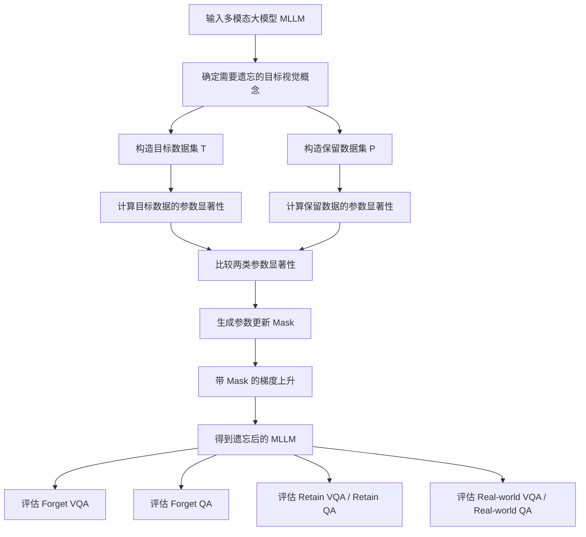

## 1. 论文基本信息

| 项目 | 内容 |
|---|---|
| 论文标题 | MMUnlearner: Reformulating Multimodal Machine Unlearning in the Era of Multimodal Large Language Models |
| 中文标题 | MMUnlearner：在多模态大语言模型时代重新定义多模态机器遗忘 |
| 研究方向 | 多模态大模型中的机器遗忘 |
| 发表会议 | ACL 2025 |
| arXiv | https://arxiv.org/abs/2502.11051 |
| GitHub | https://github.com/Z1zs/MMUnlearner |
| 核心目标 | 忘掉目标实体的视觉模式，同时保留对应的文本知识 |

---

## 2. 论文主要研究什么？

这篇论文研究的是 **多模态大语言模型（MLLM）中的机器遗忘问题**。

传统机器遗忘通常关注纯文本大语言模型，希望模型忘掉某些文本知识或训练样本。

但是多模态大模型同时包含：

1. **视觉知识**：模型看到图像时识别某个人、物体或实体的能力。
2. **文本知识**：模型通过纯文本问题回答实体相关事实的能力。

作者认为，多模态机器遗忘不应该简单地让模型“把某个实体全部忘掉”，而应该更加细粒度：

> 模型应该忘掉目标实体的视觉特征，但保留关于该实体的文本知识。

也就是说：

> 看到目标人物的照片时，模型应该认不出来；  
> 但如果只用文字问这个人的相关事实，模型仍然应该能回答。

---

## 3. 技术路线

MMUnlearner 的整体技术路线可以概括为：



---

## 4. 方法核心：MMUnlearner

MMUnlearner 的核心思想是：

> 只更新和目标视觉概念高度相关的参数，同时保护对文本知识和非目标视觉概念重要的参数。

### 4.1 构造目标数据集

目标数据集记作 `T`，包含需要被遗忘的视觉概念。

```text
T = 目标视觉概念数据
  = 目标实体图像 + 与该实体相关的 VQA 问答
```

例如，如果要让模型忘掉某个人的视觉特征，那么 `T` 中包含这个人的图像以及相关视觉问答。

---

### 4.2 构造保留数据集

保留数据集记作 `P`，包含不应该被破坏的知识。

```text
P = 需要保留的知识
  = 目标实体的文本 QA
  + 非目标实体的 VQA
  + 非目标实体的文本 QA
```

也就是说，模型应该：

- 忘掉目标实体的视觉识别能力；
- 保留目标实体的文本知识；
- 保留其他实体的视觉知识；
- 保留其他实体的文本知识。

---

### 4.3 计算参数显著性

MMUnlearner 使用类似 **Fisher Information / Gradient Saliency** 的方式估计参数重要性。

直观理解：

```text
如果某个参数对目标视觉概念很重要，
但对保留知识不重要，
那么这个参数可以被更新。

如果某个参数对保留知识很重要，
那么这个参数应该被保护。
```

论文中使用梯度平方近似参数显著性：

```text
Saliency ≈ gradient^2
```

然后比较参数对目标数据集 `T` 和保留数据集 `P` 的重要程度。

---

### 4.4 生成参数 Mask

根据参数显著性，MMUnlearner 会生成参数更新 Mask：

```text
mask = 1：允许更新该参数
mask = 0：保护该参数，不更新或少更新
```

这样模型不会在所有参数上盲目遗忘，而是进行选择性遗忘。

---

### 4.5 带 Mask 的梯度上升

普通 Gradient Ascent 会直接增加目标数据上的 loss，让模型在目标数据上答错。

MMUnlearner 的不同点在于：

```text
只在 mask = 1 的参数上执行梯度上升
```

这样可以让模型忘掉目标视觉概念，同时减少对文本知识和其他视觉能力的破坏。

---

## 5. 与 Baseline 的区别

| 方法 | 基本思想 | 局限 |
|---|---|---|
| GA | 直接增大 Forget 数据上的 loss | 容易破坏无关知识 |
| GA_Diff | 同时遗忘 Forget 数据并保持 Retain 数据 | 没有明确区分视觉知识和文本知识 |
| KL_Min | 让模型在保留数据上接近原模型 | 对视觉概念的遗忘不够精准 |
| NPO | 将遗忘数据视为负偏好数据 | 更偏文本遗忘，不适合细粒度视觉遗忘 |
| MMUnlearner | 使用参数显著性 Mask 进行选择性更新 | 更适合实现“忘视觉、保文本” |

---

## 6. 使用的数据集

论文主要使用两个多模态机器遗忘数据集。

### 6.1 MLLMU-Bench

MLLMU-Bench 是面向多模态机器遗忘的 benchmark，包含虚构人物档案和真实公众人物档案。

它从多个角度评估模型：

- 是否忘掉目标视觉概念；
- 是否保留目标实体的文本知识；
- 是否保留非目标实体的视觉和文本知识；
- 是否保留真实世界通用能力。

---

### 6.2 CLEAR

CLEAR 是基于 TOFU 扩展而来的多模态遗忘数据集。

TOFU 原本是文本机器遗忘 benchmark，CLEAR 在此基础上加入了人物图像和视觉问答数据，用于测试多模态场景下的遗忘能力。

---

## 7. 实验模型

论文主要在以下多模态大模型上实验：

- LLaVA-1.5-7B
- Qwen2-VL-7B-Instruct
- LLaVA-1.5-13B

---

## 8. 评价指标

| 指标 | 含义 | 期望结果 |
|---|---|---|
| Forget VQA | 目标视觉概念是否被忘掉 | 越低越好 |
| Forget QA | 目标实体文本知识是否被保留 | 越高越好 |
| Retain VQA | 非目标视觉知识是否被保留 | 越高越好 |
| Retain QA | 非目标文本知识是否被保留 | 越高越好 |
| Real-world VQA | 通用视觉能力是否被保留 | 越高越好 |
| Real-world QA | 通用文本能力是否被保留 | 越高越好 |

---

## 9. 论文主要结论

论文实验表明：

1. MMUnlearner 更能有效遗忘目标视觉概念。
2. MMUnlearner 更好地保留目标实体的文本知识。
3. MMUnlearner 对非目标视觉概念和通用能力的破坏更小。
4. 直接把 LLM 遗忘方法迁移到 MLLM 上是不够的。
5. 多模态机器遗忘需要专门考虑视觉知识与文本知识的解耦。

---

## 10. 论文存在的问题

### 10.1 数据集覆盖范围有限

论文主要在 MLLMU-Bench 和 CLEAR 上实验，但真实世界中的遗忘场景更加复杂。

例如：

- 真实人物隐私遗忘；
- 地标遗忘；
- 品牌或 logo 遗忘；


当前实验还不能完全证明方法在真实复杂场景中的泛化能力。

---

### 10.2 遗忘后模型能力仍然会下降

虽然 MMUnlearner 比 baseline 更好，但模型在遗忘后仍可能出现 utility 下降。

例如：

- Retain VQA 可能下降；
- Real-world VQA 可能下降；
- 文本 QA 能力可能受到轻微影响。

这说明多模态模型中的视觉知识和文本知识并不是完全独立的，它们在参数空间中可能存在复杂耦合。

---

### 10.3 Forget VQA 准确率下降不一定代表真正遗忘

论文主要通过 Forget VQA accuracy 来衡量视觉概念是否被遗忘。

但模型答错不一定等于真正遗忘。

模型可能只是：

- 学会输出错误答案；
- 仍然保留目标视觉表征；
- 换一种问法后又能识别；
- 换一张相似图后又能识别；
- 被对抗性 prompt 诱导后恢复目标知识。

因此，仅用 VQA 准确率评估遗忘还不够充分。

---

### 10.4 缺少鲁棒性和可恢复性测试

真正可靠的机器遗忘应该不仅在当前测试集上有效，还要防止遗忘内容被轻易恢复。

论文中对以下问题讨论不足：

- 少量样本微调后是否会重新学会目标概念；
- 使用相似图像是否能恢复目标识别；
- 使用多轮对话是否能诱导模型说出目标身份；
- 使用 adversarial prompt 是否能绕过遗忘；
- embedding 中是否仍然保留目标身份信息。

---

### 10.5 Saliency Mask 仍然比较启发式

MMUnlearner 的核心是根据参数显著性生成 mask。

但这个过程仍然有启发式成分，例如：

- 阈值如何选择；
- 不同层是否应该使用不同阈值；
- vision encoder、projector、LLM backbone 是否应该使用不同策略；
- hard mask 是否过于粗糙；
- 是否可以使用连续 mask 或可学习 mask。


---

## 11. 下一步改进方向

### 11.1 构建更真实的多模态遗忘 Benchmark

可以设计一个更接近真实场景的数据集，覆盖：

- 真实人物；
- 真实地标；
- 品牌 logo；
- 艺术风格；


同时加入更多鲁棒性测试：

```text
同一个目标，不同图片
同一个目标，不同角度
同一个目标，不同光照
同一个目标，不同背景
同一个目标，不同 prompt
同一个目标，多轮对话追问
```

---

### 11.2 设计更细粒度的遗忘模式

未来可以不只研究“忘视觉、保文本”，而是设计多种遗忘模式。

```text
Mode 1：只忘视觉，保留文本
Mode 2：只忘文本，保留视觉
Mode 3：视觉和文本都忘
Mode 4：忘身份，但保留通用属性
Mode 5：忘版权风格，但保留普通视觉理解
Mode 6：忘敏感属性，但保留非敏感描述能力
```

这样可以适配不同应用场景。

---

### 11.3 改进参数 Mask 机制

当前 MMUnlearner 使用基于显著性的 hard mask。

未来可以改进为：

- layer-wise mask；
- block-wise mask；
- continuous mask；
- learnable mask；
- adaptive threshold；
- 不同模块使用不同 mask；
- 使用 bilevel optimization 自动学习 mask。

这样可能进一步减少模型能力下降。

---

### 11.4 加入更强的鲁棒性评估

可以加入以下测试，判断模型是否真正遗忘：

```text
1. Prompt 改写测试
2. 图像增强测试
3. Adversarial prompt 测试
4. 多轮对话诱导测试
5. 少量样本重新学习测试
6. Membership inference 测试
7. Embedding probe 测试
```

如果模型在这些测试下仍然不能恢复目标视觉概念，遗忘结果才更可信。

---

### 11.5 加入机制解释分析

未来可以进一步分析：

- 视觉身份信息主要存在 vision encoder、projector 还是 LLM backbone；
- 哪些层负责视觉概念识别；
- 哪些层负责文本知识存储；
- 遗忘前后 attention pattern 如何变化；
- 遗忘前后 MLP neuron 如何变化；
- 遗忘前后 visual token representation 如何变化。

这可以帮助理解 MLLM 中视觉知识和文本知识的存储机制。

---

### 11.6 设计更轻量的部署方案

为了让方法更容易应用到大模型，可以探索：

- LoRA-only unlearning；
- projector-only unlearning；
- vision encoder 冻结；
- 只更新少数关键层；
- 低秩 saliency approximation；
- block-level saliency；
- parameter-efficient unlearning。

---
